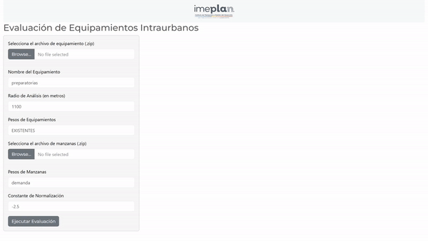

# Evaluación de equipamientos Intraurbanos IMEPLAN

Este repositorio documenta el proyecto de Evaluación de Equipamientos Intraurbanos, desarrollado para el Instituto Metropolitano de Planeación del Área Metropolitana de Guadalajara (IMEPLAN). El objetivo de este proyecto fue analizar y evaluar la distribución y suficiencia de equipamientos urbanos para mejorar la toma de decisiones en planificación urbana y optimizar la infraestructura en función de la demanda poblacional.

Utilizando ciencia de datos, análisis espacial y modelado estadístico, se automatizó una metodología que permite evaluar la proximidad y capacidad de los equipamientos, así como identificar déficits y superávits de servicios en diferentes zonas. El proyecto incluyó la creación de un dashboard interactivo en Shiny, el cual facilita a los urbanistas explorar diferentes escenarios y tomar decisiones basadas en datos.

Este fue un proyecto interdisciplinar, donde la ciencia de datos fue clave para comprender y optimizar el desarrollo urbano del Área Metropolitana de Guadalajara, con un enfoque en mejorar la calidad de vida de sus habitantes a través de una planificación informada y precisa.

  

